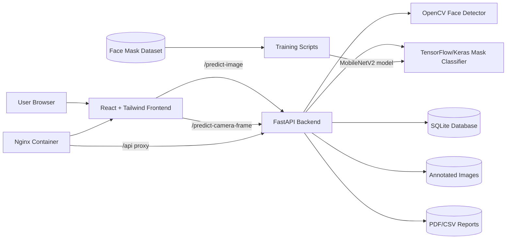
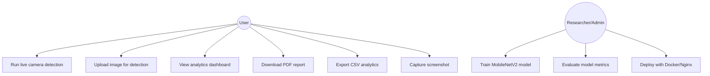
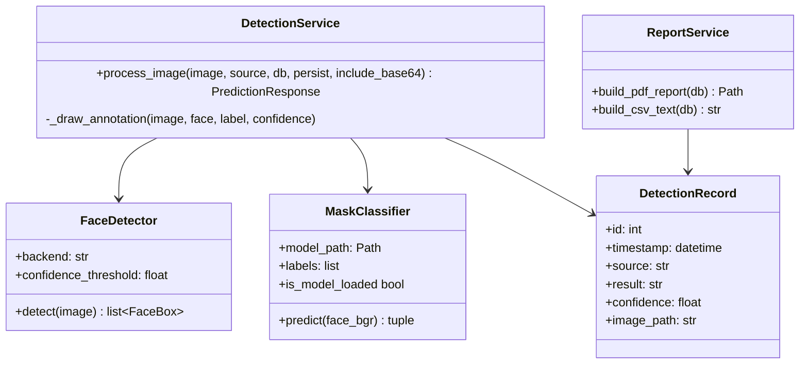
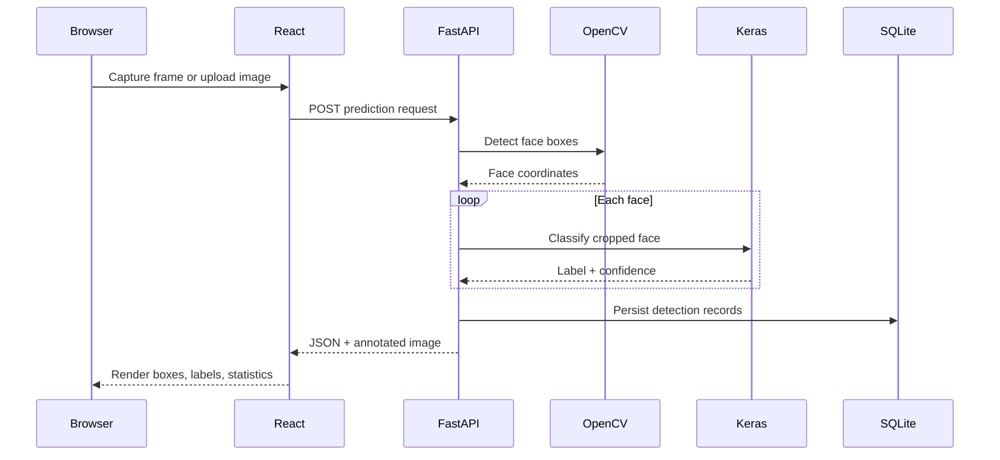
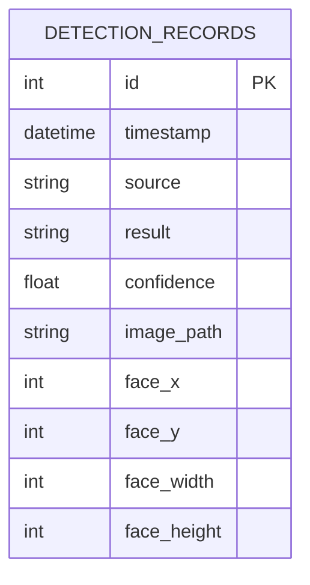

# System Diagrams

## System Architecture Diagram

```mermaid
flowchart LR
  User[User Browser] --> React[React + Tailwind Frontend]
  React -->|/predict-image| API[FastAPI Backend]
  React -->|/predict-camera-frame| API
  API --> OpenCV[OpenCV Face Detector]
  API --> Keras[TensorFlow/Keras Mask Classifier]
  API --> SQLite[(SQLite Database)]
  API --> Uploads[(Annotated Images)]
  API --> Reports[(PDF/CSV Reports)]
  Training[Training Scripts] -->|MobileNetV2 model| Keras
  Dataset[(Face Mask Dataset)] --> Training
  Nginx[Nginx Container] --> React
  Nginx -->|/api proxy| API
```

## Use Case Diagram

```mermaid
flowchart TB
  Actor((User))
  Admin((Researcher/Admin))
  Actor --> UC1[Run live camera detection]
  Actor --> UC2[Upload image for detection]
  Actor --> UC3[View analytics dashboard]
  Actor --> UC4[Download PDF report]
  Actor --> UC5[Export CSV analytics]
  Actor --> UC6[Capture screenshot]
  Admin --> UC7[Train MobileNetV2 model]
  Admin --> UC8[Evaluate model metrics]
  Admin --> UC9[Deploy with Docker/Nginx]
```

## Class Diagram

```mermaid
classDiagram
  class FaceDetector {
    +backend: str
    +confidence_threshold: float
    +detect(image) list~FaceBox~
  }
  class MaskClassifier {
    +model_path: Path
    +labels: list
    +is_model_loaded bool
    +predict(face_bgr) tuple
  }
  class DetectionService {
    +process_image(image, source, db, persist, include_base64) PredictionResponse
    -_draw_annotation(image, face, label, confidence)
  }
  class ReportService {
    +build_pdf_report(db) Path
    +build_csv_text(db) str
  }
  class DetectionRecord {
    +id: int
    +timestamp: datetime
    +source: str
    +result: str
    +confidence: float
    +image_path: str
  }
  DetectionService --> FaceDetector
  DetectionService --> MaskClassifier
  DetectionService --> DetectionRecord
  ReportService --> DetectionRecord
```

## Sequence Diagram

```mermaid
sequenceDiagram
  participant Browser
  participant React
  participant FastAPI
  participant OpenCV
  participant Keras
  participant SQLite

  Browser->>React: Capture frame or upload image
  React->>FastAPI: POST prediction request
  FastAPI->>OpenCV: Detect face boxes
  OpenCV-->>FastAPI: Face coordinates
  loop Each face
    FastAPI->>Keras: Classify cropped face
    Keras-->>FastAPI: Label + confidence
  end
  FastAPI->>SQLite: Persist detection records
  FastAPI-->>React: JSON + annotated image
  React-->>Browser: Render boxes, labels, statistics
```

## ER Diagram

```mermaid
erDiagram
  DETECTION_RECORDS {
    int id PK
    datetime timestamp
    string source
    string result
    float confidence
    string image_path
    int face_x
    int face_y
    int face_width
    int face_height
  }
```
